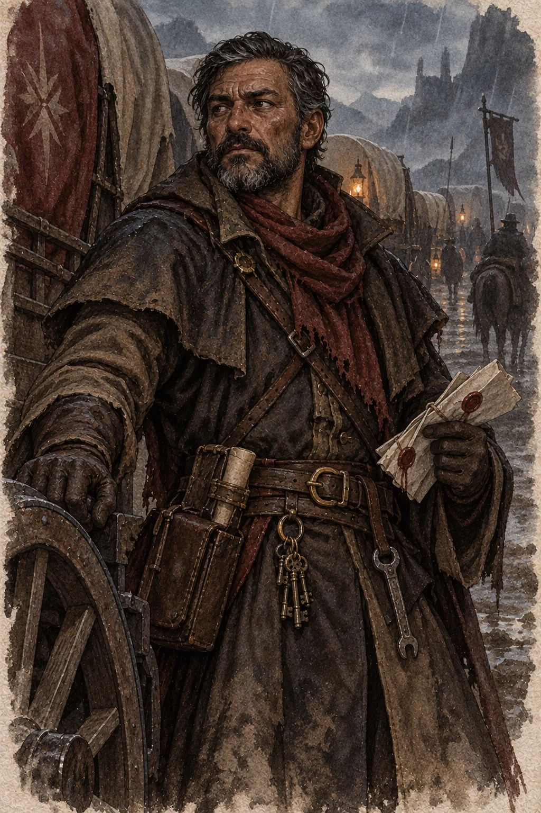

*Milo Calvetti*

Milo Calvetti has run wagon trains for [[Casa Berruel]], one of the great
houses of the [[Thurion Merchant Alliance]], for eleven years and has never
lost one. He checks the axles himself before every departure, pays
the guards out of his own purse when the house is slow, and knows the Uplad
horse road well enough to name the stream crossings that flood a day before
the sky says they will. He was put on this contract because the cargo was
worth being careful with, not because he was cheap.

He does not know why the house was careful about the wrong things. Two of the
wagons were sealed at Vessene and he was told not to open them, which is not
unusual for a Melisor charter — academies ship things they don't want a
teamster asking about. What is unusual is that Casa Berruel's factor walked
the yard himself the morning they left, checked the manifest against the
seals, and never once checked the water barrels.

- **Want** Deliver the consignment and collect the balance Casa Berruel is
  three weeks late paying him
- **Won't** Leave a wagon behind while there is still a wheel under it
- **Knows** Every mile of the Uplad road better than the maps do, and exactly
  what's in every wagon except the two he was told to leave sealed
- **After the ambush** He watched the dead walk past three armed guards to
  reach the cargo, which is not what a raising does, and he is the party's
  best witness that something about this was arranged

*He would tell you he has never lost a wagon. He has not worked out yet that
this one wasn't lost — it was spent.*
