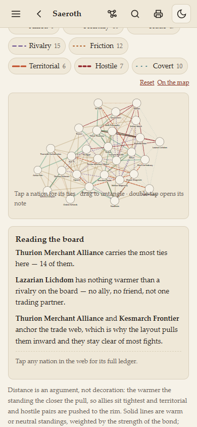
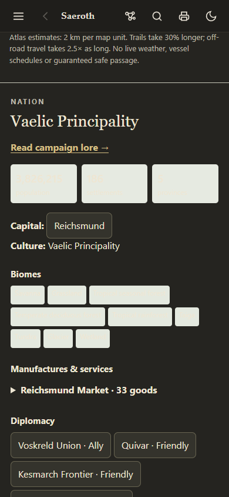
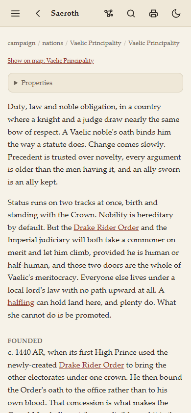
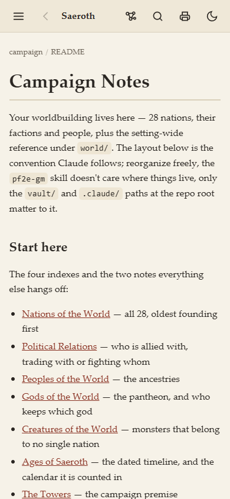
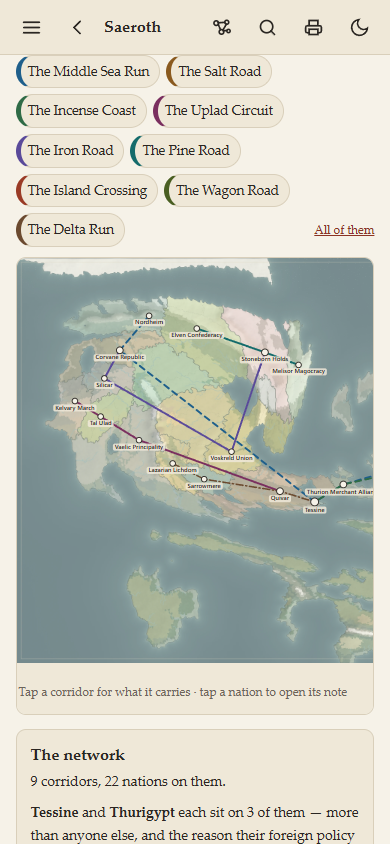
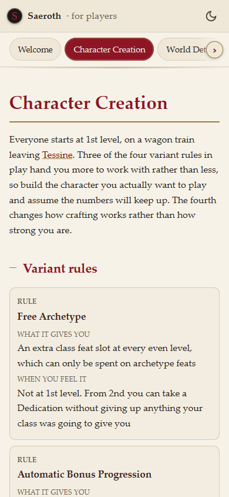

# Website UI/UX audit

Implementation follow-up: [Audit fixes](Audit%20fixes.md) records the corrections and regression checks for PR #187. The findings below describe the original audited revision.

Reviewed the published Towers of Saeroth website after PR #186. PR #187's
contrast fix was still pending and is identified separately below. This pass
is an audit, not a redesign or a release.

## Assessment

The site has a strong illustrated world and readable parchment styling, but
its navigation still reflects a repository of notes more than a tool used at
the table. The most useful improvements are a clearer starting point, legible
mobile diagrams, predictable navigation between map and notes, and a unified
set of controls. A new visual theme is not the first priority.

The atlas, wiki and player guide should retain their distinct jobs. In
particular, the player guide must remain deliberately separate from GM notes.
Shared typography, spacing and control behavior can make them feel related
without combining their content or access paths.

## Scope and evidence

Real Chrome review of the published site at 390×844 and 1440×1000, plus a
320-pixel reflow check. Inspected the campaign landing page, nation profiles,
Political Relations, Trade Routes, history/timeline, atlas, search dialog,
graph setup, an NPC/statblock page, and all seven player sections. Tested
keyboard focus and map shortcuts, and inspected representative light/dark
states and source behavior. Screenshots below are selected evidence.

This was not a screen-reader certification, an automated accessibility scan,
an exhaustive review of every note, or a performance benchmark on a physical
iPhone. Emulated dimensions do not establish touch, virtual-keyboard or Safari
behavior on actual hardware. One initially blank atlas capture was a transient
capture; the fully loaded view was checked and is not reported as a permanent
blank-page bug.

## Priority findings

### 1. High — relationship diagrams are not readable on a phone

**Observed:** the relation web fits all nations into a roughly 358-pixel-wide
board. Its 11.5-unit labels have an effective screen size of **3.66 pixels**.
The instructions overlap the bottom of the diagram. Users can select nodes,
but cannot comfortably identify them first.

**Change:** default mobile to a searchable nation list with relationship
summaries; selecting a nation should show its immediate relationships. Keep
the full graph as an optional expanded view with zoom/pan and a visible exit.
Keep text at a readable screen size independent of the diagram's coordinates.

**Acceptance:** a phone user can find Vaelic, see its ties and open a nation
note without deciphering miniature labels. Instructions never cover nodes.

### 2. High — atlas shortcuts disappear after jumping to details

**Observed:** clicking **Place details** in the mobile atlas scrolls to the
selected record, but the Map/Journey/Place details bar scrolls out of view.
Its measured top became approximately **−1896 px** in a 789-pixel-high frame.
This defeats its intended sticky navigation and makes returning to the map
require a long scroll.

**Change:** give the integrated atlas one deliberate scroll container and keep
its tool navigation outside that scrolling content, or use a persistent mobile
bottom bar. Preserve the wiki header and reserve space so neither bar covers
focused content. Treat the three options as real destinations with an active
state, rather than merely buttons that jump through a long settings column.

**Acceptance:** Map, Journey and Place details remain reachable after every
jump and after scrolling to the bottom of the selected record.

### 3. High — search does not behave as a complete modal dialog

**Observed:** Shift+Tab from the search input moves focus outside the open
dialog, behind its overlay. The visible cross is the input's clear control,
not a clearly labeled dialog close button. Escape hides the dialog without
explicitly restoring focus to the control that opened it.

**Change:** contain focus while the dialog is open, make background controls
inactive, add a labeled Close button, restore opener focus and preserve Escape
dismissal. Give search a persistent accessible/visible label rather than
depending only on its placeholder.

**Acceptance:** repeated Tab and Shift+Tab remain inside the dialog; closing
returns to the search button; mouse, touch and keyboard have obvious exits.

### 4. High — atlas cards are unreadable in the published dark theme

**Observed:** population cards and biome badges combine pale text with pale
backgrounds. These are core nation details, not decorative elements.

**Status:** already fixed and contrast-tested in **PR #187**, which had not been
published when this audit was performed. Do not redo that fix; publish it and
then check the remaining states, including selected results and native menus.

### 5. High — important note pages lack a visible page title

**Observed:** nation, relationship, trade and timeline pages start with a small
file breadcrumb, a generic **Properties** disclosure and prose. For example,
Vaelic has no main heading naming the nation. The NPC inspected also lacked a
clear page heading. The browser tab title is not a substitute in the content.

**Change:** render one page heading from frontmatter title or filename when the
body has no H1. Put a short summary and primary action beneath it. Show useful
properties such as type or capital intentionally; tuck technical metadata
away. Avoid duplicate headings on notes that already provide one.

**Acceptance:** a user can immediately answer “what am I reading?” on any
profile, and heading navigation starts with the page's subject.

### 6. Medium — the home page and navigation expose the repository structure

**Observed:** the home screen discusses `world/`, `pf2e-gm`, `.claude/` and
folder conventions. On a phone the atlas link is inside the hidden sidebar,
while the top bar presents several unlabeled-by-sight icons. The file tree is
useful for authors but demands that readers already know the filing system.

**Change:** add a task-focused landing view with Explore the map, Nations,
Relationships, Trade, History and Search. Keep the full note tree as an
advanced Browse option. Add recent places/notes only if stored locally and
clearly described; there is no need to invent an account system.

**Acceptance:** a returning player or GM can reach the main atlas or a known
nation in one or two deliberate actions without reading maintenance prose.

### 7. Medium — tools appear below long introductions

**Observed:** the relationship view is below multiple paragraphs and its
standing explanation table. Trade controls first appear near the bottom of
the opening phone viewport, with the map below them. The history introduction
similarly delays the timeline. Nation essentials appear after substantial
prose rather than as a quick-reference summary.

**Change:** put the interactive tool and a short explanation first, then keep
the full lore below or behind a “Read context” disclosure. Offer page section
links for long notes. For nation profiles, make capital, government and links
to map/relations easy to scan before the long narrative.

**Acceptance:** the first screen identifies both the subject and the useful
action; deep lore stays available without blocking quick lookup.

### 8. Medium — search is split without clear scope

**Observed:** global search searches campaign prose and rules titles; the
atlas has a separate place/route search. Searching “Pilgrim” globally returns
the peace treaty and notes mentioning it, but the map landmark requires the
atlas search. “Search” in the header suggests a broader scope than it has.

**Change:** expose explicit scopes (All, Lore, Places, Rules), or label the
current tools accurately and link between them. Group results by type, show a
short relevant excerpt and offer Show on map where a record exists. Preserve
the deliberate separation of the player guide rather than exposing GM search
there. Do not fabricate lore links for the hundreds of unmapped POI notes.

**Acceptance:** a user searching a pass or capital can tell whether they found
a map place, a lore note or a rules entry and choose the appropriate action.

### 9. Medium — several touch targets are unnecessarily small

**Measured:** main header buttons are **38×38 px**; trade filters are roughly
**34 px high**; player map zoom controls are **34×30 px**, Fit **36×30 px**;
player section tabs are about **39 px high**. The trade reset control is about
**19 px high**. These measurements are usability concerns, not blanket claims
that every target violates an accessibility standard.

**Change:** use approximately 44–48-pixel touch areas for primary controls,
allowing icons to stay visually small. Give text resets a proper hit area.
At narrow widths prioritize actions or use an overflow menu rather than
squeezing more buttons into the same header.

**Acceptance:** controls are comfortable to tap one-handed without accidental
neighbor selection, including at 320 pixels wide.

### 10. Medium — trade and player maps need clearer mobile exploration

**Observed:** the trade map is internally wider than its phone container, so
the eastern world starts offscreen. There is no prominent instruction that
the user can scroll sideways. The player map fits the whole world into about
356×200 pixels: a useful overview, but its detail requires zooming through the
small controls. Clicking the nearest nation can select an unintended neighbor
in dense regions.

**Change:** offer Fit world and Focus selected route/nation, obvious zoom/pan
controls or a fullscreen view, and a searchable nation list as an alternative
to precision map taps. Label trade lines as schematic connections: they are
not the Living Atlas's navigable road geometry. Surface an explicit handoff
to Journey planning only where an actual route is available.

### 11. Medium — map navigation state is not part of the host navigation

**Confirmed in the repository audit:** selecting Quivar inside an atlas opened
at Vaelic leaves the outer URL pointing to Vaelic; refreshing restores the old
selection. The wiki's back trail and map selection history therefore differ.

**Change:** synchronize selected place with the host URL without reloading the
renderer. Define Back, refresh and “copy link” behavior consistently. Preserve
the camera and filters when briefly opening a linked note if practical.

**Acceptance:** sharing a link opens the displayed place, and returning from
lore does not unexpectedly reset the exploration task.

### 12. Medium — graph and atlas controls demand too much setup

**Observed:** the graph opens with folder scopes, counts and a blank canvas;
its Render action can be below the visible part of the options panel on a
phone. The atlas offers many layer/tier controls before the journey and record
details, requiring a long scroll. Controls expose implementation choices
before the user has accomplished a basic task.

**Change:** give the graph a useful campaign-only default and make advanced
scopes secondary. Give the atlas a small set of view presets such as Explore,
Political and Travel, with advanced layer settings in a drawer. Prioritize
the selected record or journey rather than displaying every setting first.

**Acceptance:** opening a tool immediately yields a useful view; advanced
controls remain available without being mandatory reading.

## Player guide: retain the stronger design

The player guide has clear page titles, a consistent crimson/gold identity,
readable prose, useful mobile table-to-card conversion, and directional hints
on its scrolling section tabs. Preserve these. Improvements should focus on
larger map controls, local section links for long pages, and clearer keyboard
behavior for tabs. Review tab roles/arrow-key behavior rather than assuming
ordinary buttons constitute a complete accessible tab interface.

## What already works

- Main content did not produce document-wide horizontal overflow in the tested
  390-pixel pages or the 320-pixel landing-page check; maps use their own scroll
  containers where needed.
- The illustrated atlas has a strong identity and its map controls are more
  prominent than the wiki's small top-bar icons.
- Body prose is readable with generous line spacing; inline links are visually
  recognizable in the inspected light and dark views.
- Relationship and trade views combine line styles with color, and have
  keyboard-operable nation nodes and accompanying text summaries.
- The player guide presents hand-written player information separately from
  the campaign reader. Keep that boundary.
- The atlas now fills the main site area without the earlier duplicate title
  and inset-frame margins. It does not need another wholesale renderer rewrite
  to fix its remaining navigation and scroll issues.

## Recommended sequence

1. **Usability blockers:** publish the pending contrast fix; repair sticky atlas
   shortcuts and modal focus; provide readable mobile relationship exploration.
2. **Information structure:** clear titles, task-focused landing/navigation,
   tool-first layouts, scoped search and predictable map/notes history.
3. **Consistent controls:** shared spacing/type/control tokens, larger touch
   areas, clearer selected states and preset-driven map controls.
4. **Validation:** test these journeys with keyboard and on a real iPhone:
   find a nation → view its ties → open its map location → plan a journey →
   read lore → return; separately test player onboarding → Nations → select
   a country. Check dark mode and larger text with those same tasks.

No website behavior was changed or published during this UI/UX audit. The
report extends the earlier repository audit with visual and interaction
evidence; its recommendations are not a claim that all fixes are implemented.
