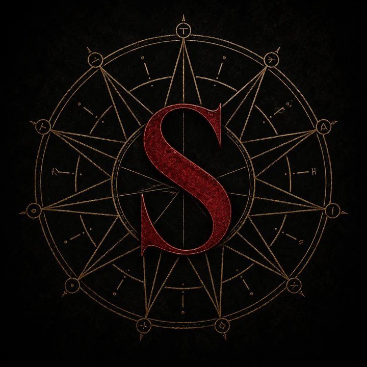

# Welcome to Saeroth

Everything here is **what your character could plausibly know**: the sort of
thing you pick up from a season on the road, a good tavern, or a schoolroom.
Treat it as a traveller's picture of the world rather than a true one. Some of
it is years out of date, and a fair amount of it is what people say instead of
what happened.

## Introduction

Nobody under sixty has seen a war between great powers. The **Pilgrim's
Peace** was signed at Concord in 2316 and has held for the sixty years since,
which is longer than any peace anybody has a record of. It holds because it
starves a war rather than forbidding one. A country may declare whatever it
likes, and will then find that no bank will lend against the season, no league
will carry its grain, and no chartered company will march for its coin.

Two generations have grown up inside that and it shows on them. Merchants on
the north roads argue about insurance rates instead of about bandits. Militias
drill on feast days for the look of the thing, and half the swords in a border
garrison have never been out of the scabbard anywhere but a yard. The
granaries are full, and the men who own the granaries have never eaten better.
The few who fought in the last war are in their eighties now and nobody asks
them about it. Ask anyone at a good table what the Peace has cost them and
they will tell you nothing, and as far as they know it they will be telling
the truth.

Then, a year ago, there was a tower standing where the evening before there
had been pasture.

Nobody watched it happen and nobody has watched one since. The stone is pale
and seamless, nothing grows on it, nothing has weathered, and it is worked
from the footings to the crown with an extravagance no cathedral on either
continent could pay for. Up close there are figures cut into it, and the
people who have stood in front of those keep reaching for the same word, which
is *cruel*. More of them turn up every season and nobody can say where the
next one will stand.

Every tower anyone has found is open. The door is not guarded, it does not
close, and it will not let you back out, which has been tested with a rope and
a volunteer in front of witnesses more times than anyone cares to count. What
everybody has heard is that whoever reaches the top comes out its master, and
comes out richer than any crown. Nobody can say who started that, and no one
who would know has come back to say anything, and it has been enough.
Expeditions are being funded out of treasuries meant for roads. Two nations
are arguing over a stretch of jungle neither of them wanted last year. The
queue outside a door nobody returns from is not getting shorter, and nothing
in the treaty covers a tower.

## Character hook

You are travelling with a **Thurion Merchant Alliance** wagon train, out of
**Tessine** and bound west through **Quivar** for the **Vaelic
Principality**. The cargo is a season's supplies for an expedition the
**Melisor Magocracy** is paying for: a fourth tower that nobody has confirmed
exists, in a valley that three of the Magocracy's competing theories all
happen to point at.

How you came to be on it is yours to choose.

- **Hired on as a guard.** The house running the contract is paying above the
  going rate and did not ask many questions.
- **A factor with your own goods in the train.** You are paying for that
  escort and you would like to see it earn the money.
- **A passenger.** You bought a seat because the train was going your way, and
  because the road north of Quivar is better with company.
- **A stowaway.** Nobody has found you yet.

None of you need to have met before. A wagon train is how strangers end up
sharing a fire for a fortnight, and the last leg of this one runs four days
through empty country where Quivar, the Principality and the **Lazarian
Lichdom** all meet, and where none of the three keeps a patrol, because
patrolling it would mean explaining what you were doing out there.

## The shape of the world

Two settled continents with a wide sea between them, and a third in the south
that nobody has finished taking.

- **The west** is old kingdoms packed close: princes, republics, theocracies
  and a magocracy, most of them within a few weeks' ride of somebody they have
  fought before.
- **The east** is larger, and strange to western eyes. An empire whose
  ministries have been writing everything down for eighteen centuries, a
  khaganate on the steppe, two desert powers, jungle confederacies, and a
  nation that farms the slopes of a live volcano and evacuates when it has
  to.
- **The sea between them** is run by two powers who between them move nearly
  everything: the Thurion Merchant Alliance and the island fleets of Aquoniti.
- **The Wildlands**, in the south, are mostly unclaimed. Three nations hold a
  coastal enclave apiece. The interior belongs to whatever is still standing
  in it.
